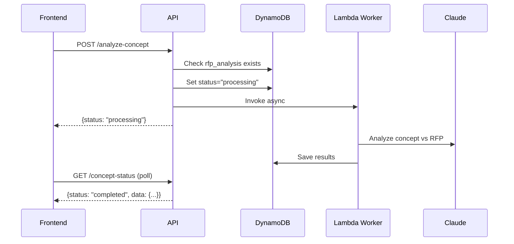

## Overview

Analyzes the uploaded concept document against RFP requirements and identifies sections that need elaboration. This is part of Step 2 in the proposal workflow.

<Warning>
  **Prerequisite**: RFP analysis must be completed before analyzing the concept.
</Warning>

## Workflow Pattern

Follows the same **asynchronous Lambda worker pattern** as RFP analysis:

1. **Trigger**: POST to `/analyze-concept` returns immediately
2. **Lambda Worker**: Backend invokes `AnalysisWorkerFunction` with `analysis_type: "concept"`
3. **Polling**: Poll GET `/concept-status` for completion
4. **Result**: Analysis includes sections needing elaboration and alignment assessment



## Request

<ParamField path="proposal_id" type="string" required>
  The proposal ID or code (format: `PROP-YYYYMMDD-XXXX`)
</ParamField>

<ParamField body="force" type="boolean" default="false">
  If `true`, forces a new analysis even if one already exists. Use this when the concept document has been re-uploaded.
</ParamField>

## Response

<ResponseField name="status" type="string">
  - `processing`: Analysis started successfully
  - `completed`: Analysis already exists (cached)
</ResponseField>

<ResponseField name="message" type="string">
  User-friendly status message
</ResponseField>

<ResponseField name="started_at" type="string">
  ISO 8601 timestamp when analysis started
</ResponseField>

<ResponseField name="cached" type="boolean">
  `true` if returning cached results
</ResponseField>

<ResponseField name="concept_analysis" type="object">
  Analysis data (only present if cached)
</ResponseField>

## Example Request

```bash
curl -X POST "https://api.igad-innovation.org/api/proposals/PROP-20260304-A1B2/analyze-concept" \
  -H "Authorization: Bearer YOUR_TOKEN" \
  -H "Content-Type: application/json" \
  -d '{ "force": false }'
```

## Example Response

### First Call (Processing)

```json
{
  "status": "processing",
  "message": "Concept analysis started. Poll /concept-status for completion.",
  "started_at": "2026-03-04T10:35:00.000Z"
}
```

### With Cached Result

```json
{
  "status": "completed",
  "concept_analysis": {
    "sections_needing_elaboration": [
      {
        "title": "Technical Architecture",
        "current_content": "We will build a scalable platform...",
        "gaps": ["Missing technology stack details", "No scalability metrics"],
        "suggestions": ["Specify database technology", "Define expected user load"]
      }
    ],
    "alignment_score": 75,
    "strengths": ["Clear problem statement", "Well-defined target audience"],
    "concerns": ["Budget justification lacks detail"]
  },
  "message": "Concept already analyzed",
  "cached": true
}
```

## Force Re-analysis

When a user re-uploads their concept document, use `force: true` to trigger a fresh analysis:

```typescript
const reanalyzeAfterUpload = async (proposalId: string) => {
  const response = await fetch(
    `/api/proposals/${proposalId}/analyze-concept`,
    {
      method: 'POST',
      headers: {
        'Authorization': `Bearer ${token}`,
        'Content-Type': 'application/json'
      },
      body: JSON.stringify({ force: true })
    }
  )
  return response.json()
}
```

### What Force Re-analysis Clears

When `force: true` is provided, the endpoint removes:

```python
REMOVE concept_analysis,
       concept_analysis_completed_at,
       concept_analysis_error,
       concept_evaluation,
       concept_document_v2,
       structure_workplan_analysis,
       structure_workplan_completed_at,
       structure_workplan_error
SET analysis_status_concept = :not_started
```

<Warning>
  **Cascading Effect**: Force re-analysis clears downstream artifacts (concept document, structure workplan) since they depend on the concept analysis.
</Warning>

## Status Values

The `analysis_status_concept` field tracks the analysis state:

| Status | Description |
|--------|-------------|
| `not_started` | No analysis triggered yet |
| `processing` | Lambda worker is analyzing |
| `completed` | Analysis finished successfully |
| `failed` | Analysis encountered an error |

## Polling for Status

<Card title="GET /api/proposals/{proposal_id}/concept-status" icon="clock" href="#get-concept-status">
  Check concept analysis completion status
</Card>

### Polling Example

```typescript
const pollConceptStatus = async (proposalId: string) => {
  const maxAttempts = 100 // 5 minutes at 3-second intervals
  let attempts = 0

  const interval = setInterval(async () => {
    attempts++
    
    if (attempts > maxAttempts) {
      clearInterval(interval)
      throw new Error('Analysis timeout')
    }

    const response = await fetch(
      `/api/proposals/${proposalId}/concept-status`,
      { headers: { Authorization: `Bearer ${token}` } }
    )
    const data = await response.json()

    if (data.status === 'completed') {
      clearInterval(interval)
      handleConceptAnalysis(data.concept_analysis)
    } else if (data.status === 'failed') {
      clearInterval(interval)
      showError(data.error)
    }
  }, 3000)
}
```

## Lambda Worker Details

### Lambda Invocation Payload

```python
lambda_client.invoke(
    FunctionName=worker_function_arn,
    InvocationType="Event",  # Async
    Payload=json.dumps({
        "proposal_id": proposal_code,  # PROP-YYYYMMDD-XXXX format
        "analysis_type": "concept"
    })
)
```

### DynamoDB Status Management

**Before invocation:**
```python
await db_client.update_item(
    pk=pk,
    sk="METADATA",
    update_expression="SET analysis_status_concept = :status, concept_analysis_started_at = :started",
    expression_attribute_values={
        ":status": "processing",
        ":started": datetime.utcnow().isoformat()
    }
)
```

**After completion (in worker):**
```python
db_client.update_item_sync(
    pk=pk,
    sk="METADATA",
    update_expression="SET analysis_status_concept = :status, concept_analysis = :analysis, concept_analysis_completed_at = :completed",
    expression_attribute_values={
        ":status": "completed",
        ":analysis": result,
        ":completed": datetime.utcnow().isoformat()
    }
)
```

## Error Handling

### Status Code 400 - Missing RFP Analysis

```json
{
  "detail": "RFP analysis must be completed first"
}
```

### Status Code 400 - No Concept Document

```json
{
  "detail": "Concept document not found. Please upload a concept document or provide initial concept text."
}
```

### Status Code 403

```json
{
  "detail": "Access denied"
}
```

### Status Code 404

```json
{
  "detail": "Proposal not found"
}
```

### Status Code 500

```json
{
  "detail": "Concept analysis failed: Worker Lambda invocation error"
}
```

---

## GET Concept Status

<api method="GET" url="/api/proposals/{proposal_id}/concept-status" />

### Description

Poll this endpoint to check concept analysis completion status.

### Request

<ParamField path="proposal_id" type="string" required>
  The proposal ID or code
</ParamField>

### Response

<ResponseField name="status" type="string">
  Current status: `not_started`, `processing`, `completed`, or `failed`
</ResponseField>

<ResponseField name="concept_analysis" type="object">
  Analysis results (only when completed)
  
  <Expandable title="concept_analysis structure">
    <ResponseField name="sections_needing_elaboration" type="array">
      Array of sections that need more detail
      
      <Expandable title="section object">
        <ResponseField name="title" type="string">
          Section title
        </ResponseField>
        <ResponseField name="current_content" type="string">
          Excerpt from current concept
        </ResponseField>
        <ResponseField name="gaps" type="array">
          List of identified gaps
        </ResponseField>
        <ResponseField name="suggestions" type="array">
          Recommendations for improvement
        </ResponseField>
      </Expandable>
    </ResponseField>
    
    <ResponseField name="alignment_score" type="number">
      Score from 0-100 indicating alignment with RFP
    </ResponseField>
    
    <ResponseField name="strengths" type="array">
      List of strong points in the concept
    </ResponseField>
    
    <ResponseField name="concerns" type="array">
      List of concerns or risks
    </ResponseField>
  </Expandable>
</ResponseField>

<ResponseField name="completed_at" type="string">
  ISO timestamp (only when completed)
</ResponseField>

<ResponseField name="started_at" type="string">
  ISO timestamp (only when processing)
</ResponseField>

<ResponseField name="error" type="string">
  Error message (only when failed)
</ResponseField>

### Example Response (Completed)

```json
{
  "status": "completed",
  "concept_analysis": {
    "sections_needing_elaboration": [
      {
        "title": "Methodology",
        "current_content": "We will use agile development practices...",
        "gaps": [
          "No sprint duration specified",
          "Missing stakeholder engagement plan"
        ],
        "suggestions": [
          "Define sprint length (1-2 weeks recommended)",
          "Outline monthly stakeholder review meetings"
        ]
      },
      {
        "title": "Risk Management",
        "current_content": "We have identified potential technical risks...",
        "gaps": [
          "No mitigation strategies provided"
        ],
        "suggestions": [
          "Add specific mitigation actions for each identified risk"
        ]
      }
    ],
    "alignment_score": 78,
    "strengths": [
      "Clear understanding of target beneficiaries",
      "Realistic timeline",
      "Strong team qualifications"
    ],
    "concerns": [
      "Budget distribution heavily weighted toward personnel costs",
      "Limited discussion of sustainability post-project"
    ]
  },
  "completed_at": "2026-03-04T10:37:23.000Z"
}
```

### Example Response (Processing)

```json
{
  "status": "processing",
  "started_at": "2026-03-04T10:35:00.000Z"
}
```

### Example Response (Failed)

```json
{
  "status": "failed",
  "error": "Unable to parse concept document format"
}
```

## Next Steps

After concept analysis completes, the user can:

1. Review identified gaps and suggestions
2. Select which sections to include in the refined concept document
3. Trigger concept document generation:

<Card title="POST /api/proposals/{proposal_id}/generate-concept-document" icon="file-pen" href="/api/proposals/generate-concept">
  Generate enhanced concept document based on analysis
</Card>

## Best Practices

<Tip>
  **When to use force re-analysis**:
  - User uploads a new version of their concept document
  - User significantly edits their initial concept text (100+ characters)
  - Previous analysis encountered an error and you want to retry
</Tip>

<Check>
  **Always check for cached results** first - if `status: "completed"` is returned immediately with data, skip the polling step entirely.
</Check>
