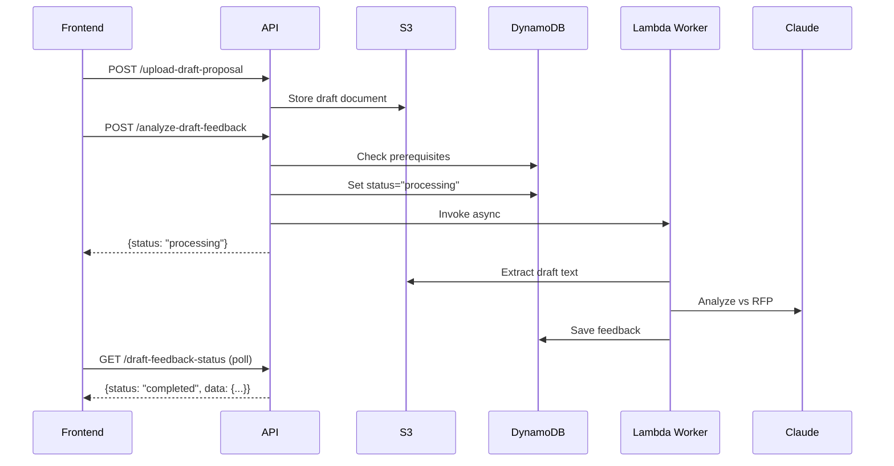

## Overview

Analyzes the uploaded draft proposal document against RFP requirements and provides section-by-section feedback. This is Step 4 in the proposal workflow, helping users refine their draft before final submission.

<Warning>
  **Prerequisites**:
  - RFP analysis must be completed (Step 1)
  - Draft proposal document must be uploaded
</Warning>

## Workflow Pattern

Follows the **asynchronous Lambda worker pattern**:

1. **Upload Draft**: User uploads draft proposal via `/upload-draft-proposal`
2. **Trigger Analysis**: POST to `/analyze-draft-feedback` starts analysis
3. **Lambda Worker**: Backend invokes worker with `analysis_type: "draft_feedback"`
4. **Polling**: Poll GET `/draft-feedback-status` for completion
5. **Review Feedback**: Display section-by-section recommendations



## Request

<ParamField path="proposal_id" type="string" required>
  The proposal ID or code (format: `PROP-YYYYMMDD-XXXX`)
</ParamField>

<ParamField body="force" type="boolean" default="false">
  If `true`, forces a new analysis even if one already exists. Use this when the draft has been re-uploaded or significantly edited.
</ParamField>

## Response

<ResponseField name="status" type="string">
  - `processing`: Analysis started successfully
  - `completed`: Analysis already exists (cached)
</ResponseField>

<ResponseField name="message" type="string">
  User-friendly status message
</ResponseField>

<ResponseField name="started_at" type="string">
  ISO 8601 timestamp when analysis started
</ResponseField>

<ResponseField name="cached" type="boolean">
  `true` if returning cached results
</ResponseField>

<ResponseField name="data" type="object">
  Feedback analysis (only present if cached)
</ResponseField>

## Example Request

```bash
curl -X POST "https://api.igad-innovation.org/api/proposals/PROP-20260304-A1B2/analyze-draft-feedback" \
  -H "Authorization: Bearer YOUR_TOKEN" \
  -H "Content-Type: application/json" \
  -d '{ "force": false }'
```

## Example Response

### First Call (Processing)

```json
{
  "status": "processing",
  "message": "Draft feedback analysis started. Poll /draft-feedback-status for completion.",
  "started_at": "2026-03-04T11:15:00.000Z"
}
```

### With Cached Result

```json
{
  "status": "completed",
  "message": "Draft feedback already analyzed",
  "data": {
    "overall_score": 82,
    "sections": [
      {
        "title": "Executive Summary",
        "score": 90,
        "strengths": ["Clear and concise", "Addresses key points"],
        "improvements": ["Add budget highlight"]
      }
    ]
  },
  "cached": true
}
```

## Upload Draft First

Before triggering feedback analysis, upload the draft document:

<Card title="POST /api/proposals/{proposal_id}/upload-draft-proposal" icon="upload">
  Upload draft proposal document (PDF, DOC, or DOCX)
</Card>

### Upload Example

```typescript
const uploadDraft = async (proposalId: string, file: File) => {
  const formData = new FormData()
  formData.append('file', file)

  const response = await fetch(
    `/api/proposals/${proposalId}/upload-draft-proposal`,
    {
      method: 'POST',
      headers: { 'Authorization': `Bearer ${token}` },
      body: formData
    }
  )

  if (!response.ok) {
    throw new Error('Upload failed')
  }

  return response.json()
}
```

## Force Re-analysis

When a user uploads a revised draft, use `force: true`:

```typescript
const reanalyzeDraft = async (proposalId: string) => {
  const response = await fetch(
    `/api/proposals/${proposalId}/analyze-draft-feedback`,
    {
      method: 'POST',
      headers: {
        'Authorization': `Bearer ${token}`,
        'Content-Type': 'application/json'
      },
      body: JSON.stringify({ force: true })
    }
  )
  return response.json()
}
```

### What Force Re-analysis Clears

```python
REMOVE draft_feedback_analysis,
       draft_feedback_completed_at,
       draft_feedback_error
SET analysis_status_draft_feedback = :not_started
```

## Status Values

The `analysis_status_draft_feedback` field tracks analysis state:

| Status | Description |
|--------|-------------|
| `not_started` | No analysis triggered |
| `processing` | Lambda worker is analyzing |
| `completed` | Analysis finished successfully |
| `failed` | Analysis encountered an error |

## Polling for Status

<Card title="GET /api/proposals/{proposal_id}/draft-feedback-status" icon="clock" href="#get-draft-feedback-status">
  Check draft feedback analysis completion status
</Card>

### Polling Example

```typescript
const pollFeedbackStatus = async (proposalId: string) => {
  const maxAttempts = 100 // 5 minutes
  let attempts = 0

  const interval = setInterval(async () => {
    attempts++
    
    if (attempts > maxAttempts) {
      clearInterval(interval)
      throw new Error('Analysis timeout')
    }

    const response = await fetch(
      `/api/proposals/${proposalId}/draft-feedback-status`,
      { headers: { Authorization: `Bearer ${token}` } }
    )
    const data = await response.json()

    if (data.status === 'completed') {
      clearInterval(interval)
      displayFeedback(data.data)
    } else if (data.status === 'failed') {
      clearInterval(interval)
      showError(data.error)
    }
  }, 3000)
}
```

## Lambda Worker Details

### Lambda Invocation Payload

```python
lambda_client.invoke(
    FunctionName=worker_function_arn,
    InvocationType="Event",  # Async
    Payload=json.dumps({
        "proposal_id": proposal_code,  # PROP-YYYYMMDD-XXXX format
        "analysis_type": "draft_feedback"
    })
)
```

### DynamoDB Status Management

**Before invocation:**
```python
await db_client.update_item(
    pk=pk,
    sk="METADATA",
    update_expression="SET analysis_status_draft_feedback = :status, draft_feedback_started_at = :started",
    expression_attribute_values={
        ":status": "processing",
        ":started": datetime.utcnow().isoformat()
    }
)
```

**After completion (in worker):**
```python
db_client.update_item_sync(
    pk=pk,
    sk="METADATA",
    update_expression="SET analysis_status_draft_feedback = :status, draft_feedback_analysis = :feedback, draft_feedback_completed_at = :completed",
    expression_attribute_values={
        ":status": "completed",
        ":feedback": feedback_result,
        ":completed": datetime.utcnow().isoformat()
    }
)
```

## Error Handling

### Status Code 400 - Missing RFP Analysis

```json
{
  "detail": "Step 1 (RFP analysis) must be completed before draft feedback analysis."
}
```

### Status Code 400 - No Draft Uploaded

```json
{
  "detail": "Please upload your draft proposal first."
}
```

### Status Code 403

```json
{
  "detail": "Access denied"
}
```

### Status Code 404

```json
{
  "detail": "Proposal not found"
}
```

### Status Code 500

```json
{
  "detail": "Failed to start draft feedback analysis: Worker invocation error"
}
```

---

## GET Draft Feedback Status

<api method="GET" url="/api/proposals/{proposal_id}/draft-feedback-status" />

### Description

Poll this endpoint to check draft feedback analysis completion status.

### Request

<ParamField path="proposal_id" type="string" required>
  The proposal ID or code
</ParamField>

### Response

<ResponseField name="status" type="string">
  Current status: `not_started`, `processing`, `completed`, or `failed`
</ResponseField>

<ResponseField name="data" type="object">
  Feedback analysis results (only when completed)
  
  <Expandable title="data structure">
    <ResponseField name="overall_score" type="number">
      Overall quality score (0-100)
    </ResponseField>
    
    <ResponseField name="overall_feedback" type="string">
      General assessment and recommendations
    </ResponseField>
    
    <ResponseField name="sections" type="array">
      Section-by-section analysis
      
      <Expandable title="section object">
        <ResponseField name="title" type="string">
          Section title
        </ResponseField>
        
        <ResponseField name="score" type="number">
          Section quality score (0-100)
        </ResponseField>
        
        <ResponseField name="strengths" type="array">
          What's working well in this section
        </ResponseField>
        
        <ResponseField name="improvements" type="array">
          Specific recommendations for improvement
        </ResponseField>
        
        <ResponseField name="missing_elements" type="array">
          RFP requirements not addressed
        </ResponseField>
      </Expandable>
    </ResponseField>
    
    <ResponseField name="alignment_with_rfp" type="object">
      Assessment of alignment with RFP requirements
      
      <Expandable title="alignment structure">
        <ResponseField name="met_requirements" type="array">
          RFP requirements successfully addressed
        </ResponseField>
        
        <ResponseField name="partially_met" type="array">
          Requirements partially addressed
        </ResponseField>
        
        <ResponseField name="unmet_requirements" type="array">
          Missing or inadequate requirements
        </ResponseField>
      </Expandable>
    </ResponseField>
    
    <ResponseField name="recommendations" type="array">
      Priority actions to improve the proposal
    </ResponseField>
  </Expandable>
</ResponseField>

<ResponseField name="started_at" type="string">
  ISO timestamp when analysis started
</ResponseField>

<ResponseField name="completed_at" type="string">
  ISO timestamp when analysis completed
</ResponseField>

<ResponseField name="error" type="string">
  Error message (only when failed)
</ResponseField>

### Example Response (Completed)

```json
{
  "status": "completed",
  "started_at": "2026-03-04T11:15:00.000Z",
  "completed_at": "2026-03-04T11:17:45.000Z",
  "data": {
    "overall_score": 82,
    "overall_feedback": "Strong proposal with clear objectives and methodology. Main areas for improvement are budget justification and sustainability planning.",
    "sections": [
      {
        "title": "Executive Summary",
        "score": 90,
        "strengths": [
          "Concise and impactful opening",
          "Clearly states problem and solution",
          "Strong value proposition"
        ],
        "improvements": [
          "Add a one-sentence budget summary",
          "Include expected impact metrics"
        ],
        "missing_elements": []
      },
      {
        "title": "Technical Approach",
        "score": 85,
        "strengths": [
          "Well-defined architecture",
          "Addresses scalability concerns",
          "Good use of diagrams"
        ],
        "improvements": [
          "Expand on security measures",
          "Add more detail on API design"
        ],
        "missing_elements": [
          "Data backup and recovery strategy"
        ]
      },
      {
        "title": "Budget",
        "score": 70,
        "strengths": [
          "Detailed line items",
          "Reasonable cost estimates"
        ],
        "improvements": [
          "Add justification for personnel costs",
          "Include cost breakdown by project phase",
          "Compare with similar projects"
        ],
        "missing_elements": [
          "Indirect costs breakdown",
          "Currency exchange risk mitigation"
        ]
      }
    ],
    "alignment_with_rfp": {
      "met_requirements": [
        "Technical specifications",
        "Timeline and milestones",
        "Team qualifications"
      ],
      "partially_met": [
        "Budget justification (missing indirect costs)",
        "Risk management (security gaps)"
      ],
      "unmet_requirements": [
        "Post-project sustainability plan",
        "Local capacity building strategy"
      ]
    },
    "recommendations": [
      "Priority 1: Add comprehensive sustainability section addressing post-project funding and knowledge transfer",
      "Priority 2: Expand security section with specific protocols and compliance measures",
      "Priority 3: Provide detailed budget justification including comparison with similar initiatives",
      "Priority 4: Include metrics for measuring success and impact"
    ]
  }
}
```

### Example Response (Processing)

```json
{
  "status": "processing",
  "started_at": "2026-03-04T11:15:00.000Z",
  "completed_at": null,
  "error": null
}
```

### Example Response (Failed)

```json
{
  "status": "failed",
  "started_at": "2026-03-04T11:15:00.000Z",
  "error": "Failed to extract text from draft document. Please ensure the file is not corrupted."
}
```

## Displaying Feedback

Recommended UI patterns for feedback display:

### Overall Summary Card

```tsx
<div className="feedback-summary">
  <h2>Overall Score: {data.overall_score}/100</h2>
  <p>{data.overall_feedback}</p>
</div>
```

### Section-by-Section View

```tsx
{data.sections.map(section => (
  <div key={section.title} className="section-feedback">
    <h3>
      {section.title}
      <span className="score">{section.score}/100</span>
    </h3>
    
    <div className="strengths">
      <h4>✓ Strengths</h4>
      <ul>
        {section.strengths.map(s => <li>{s}</li>)}
      </ul>
    </div>
    
    <div className="improvements">
      <h4>→ Improvements</h4>
      <ul>
        {section.improvements.map(i => <li>{i}</li>)}
      </ul>
    </div>
    
    {section.missing_elements.length > 0 && (
      <div className="missing">
        <h4>⚠ Missing Elements</h4>
        <ul>
          {section.missing_elements.map(m => <li>{m}</li>)}
        </ul>
      </div>
    )}
  </div>
))}
```

### RFP Alignment Checklist

```tsx
<div className="rfp-alignment">
  <h3>RFP Requirements</h3>
  
  <div className="met">
    <h4>✓ Met ({data.alignment_with_rfp.met_requirements.length})</h4>
    {data.alignment_with_rfp.met_requirements.map(req => (
      <div className="requirement-item complete">{req}</div>
    ))}
  </div>
  
  <div className="partial">
    <h4>⚡ Partially Met ({data.alignment_with_rfp.partially_met.length})</h4>
    {data.alignment_with_rfp.partially_met.map(req => (
      <div className="requirement-item partial">{req}</div>
    ))}
  </div>
  
  <div className="unmet">
    <h4>✗ Not Met ({data.alignment_with_rfp.unmet_requirements.length})</h4>
    {data.alignment_with_rfp.unmet_requirements.map(req => (
      <div className="requirement-item missing">{req}</div>
    ))}
  </div>
</div>
```

## Next Steps

After reviewing feedback:

1. **Revise Draft**: Address recommendations and missing elements
2. **Re-upload**: Upload revised draft
3. **Re-analyze**: Trigger feedback analysis again with `force: true`
4. **Iterate**: Repeat until achieving desired quality score
5. **Finalize**: Export final proposal for submission

## Deleting Draft

To remove a draft and its feedback:

<Card title="DELETE /api/proposals/{proposal_id}/documents/draft-proposal/{filename}" icon="trash">
  Delete draft proposal and clear feedback analysis
</Card>

## Best Practices

<Tip>
  **Iterative improvement**: Use feedback to revise your draft, then re-analyze. Most successful proposals go through 2-3 feedback cycles.
</Tip>

<Check>
  **Focus on high-impact items**: Prioritize recommendations that address unmet RFP requirements and low-scoring sections first.
</Check>

<Warning>
  **Document format matters**: Ensure your draft is a well-formatted PDF, DOC, or DOCX. Scanned images or corrupted files may fail text extraction.
</Warning>
