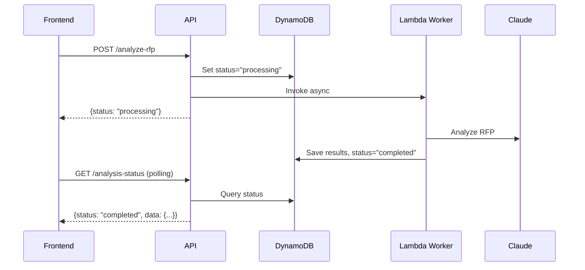

## Overview

Triggers AI analysis of the uploaded Request for Proposal (RFP) document. This is the first step in the proposal workflow. The endpoint follows an async pattern: it returns immediately after starting the analysis, and you must poll the status endpoint for completion.

## Workflow Pattern

This endpoint uses an **asynchronous Lambda worker pattern**:

1. **Trigger**: POST to `/analyze-rfp` returns immediately with `status: "processing"`
2. **Lambda Invocation**: Backend invokes `AnalysisWorkerFunction` with `InvocationType: "Event"`
3. **Polling**: Frontend polls GET `/analysis-status` every 3 seconds
4. **Completion**: Status changes to `"completed"` with analysis results



## Request

<ParamField path="proposal_id" type="string" required>
  The proposal ID or code (format: `PROP-YYYYMMDD-XXXX`)
</ParamField>

## Response

<ResponseField name="status" type="string">
  - `processing`: Analysis started successfully
  - `completed`: Analysis already exists (cached)
</ResponseField>

<ResponseField name="message" type="string">
  Instruction to poll the status endpoint
</ResponseField>

<ResponseField name="started_at" type="string">
  ISO 8601 timestamp when analysis started
</ResponseField>

<ResponseField name="cached" type="boolean">
  `true` if returning cached results (no re-analysis)
</ResponseField>

<ResponseField name="rfp_analysis" type="object">
  RFP analysis data (only present if cached/completed)
</ResponseField>

## Example Request

```bash
curl -X POST "https://api.igad-innovation.org/api/proposals/PROP-20260304-A1B2/analyze-rfp" \
  -H "Authorization: Bearer YOUR_TOKEN"
```

## Example Response

### First Call (Processing)

```json
{
  "status": "processing",
  "message": "RFP analysis started. Poll /analysis-status for completion.",
  "started_at": "2026-03-04T10:30:00.000Z"
}
```

### Subsequent Call (Cached)

```json
{
  "status": "completed",
  "rfp_analysis": {
    "semantic_query": "Build a digital platform for farmer cooperatives...",
    "key_requirements": [...],
    "evaluation_criteria": [...]
  },
  "message": "RFP already analyzed",
  "cached": true
}
```

## Status Values

The `analysis_status_rfp` field in DynamoDB tracks the analysis state:

| Status | Description |
|--------|-------------|
| `not_started` | No analysis has been triggered |
| `processing` | Lambda worker is analyzing the RFP |
| `completed` | Analysis finished successfully |
| `failed` | Analysis encountered an error |

## Polling for Status

After triggering the analysis, poll the status endpoint:

<Card title="GET /api/proposals/{proposal_id}/analysis-status" icon="clock" href="#get-analysis-status">
  Check RFP analysis completion status
</Card>

### Polling Example

```typescript
const pollStatus = async (proposalId: string) => {
  const interval = setInterval(async () => {
    const response = await fetch(
      `/api/proposals/${proposalId}/analysis-status`,
      { headers: { Authorization: `Bearer ${token}` } }
    )
    const data = await response.json()

    if (data.status === 'completed') {
      clearInterval(interval)
      console.log('Analysis complete:', data.rfp_analysis)
    } else if (data.status === 'failed') {
      clearInterval(interval)
      console.error('Analysis failed:', data.error)
    }
  }, 3000) // Poll every 3 seconds
}
```

## Lambda Worker Details

### Environment Variables

```python
worker_function_arn = os.environ.get("WORKER_FUNCTION_NAME")
# Example: "arn:aws:lambda:us-east-1:123456789012:function:AnalysisWorkerFunction"
```

### Lambda Invocation

```python
lambda_client.invoke(
    FunctionName=worker_function_arn,
    InvocationType="Event",  # Async invocation (non-blocking)
    Payload=json.dumps({
        "proposal_id": proposal_code,  # Uses PROP-YYYYMMDD-XXXX format
        "analysis_type": "rfp"
    })
)
```

### DynamoDB Updates

**Before Lambda invocation:**
```python
await db_client.update_item(
    pk=f"PROPOSAL#{proposal_code}",
    sk="METADATA",
    update_expression="SET analysis_status_rfp = :status, rfp_analysis_started_at = :started",
    expression_attribute_values={
        ":status": "processing",
        ":started": datetime.utcnow().isoformat()
    }
)
```

**After Lambda completes (in worker):**
```python
db_client.update_item_sync(
    pk=f"PROPOSAL#{proposal_code}",
    sk="METADATA",
    update_expression="SET analysis_status_rfp = :status, rfp_analysis = :result, rfp_analysis_completed_at = :completed",
    expression_attribute_values={
        ":status": "completed",
        ":result": analysis_result,
        ":completed": datetime.utcnow().isoformat()
    }
)
```

## Caching Behavior

<Warning>
  **No Re-analysis**: If `rfp_analysis` already exists in DynamoDB, the endpoint returns cached data immediately without triggering a new analysis.
</Warning>

This prevents:
- Duplicate Lambda invocations
- Unnecessary AI API costs
- Wasted processing time

## Error Handling

### Status Code 400

```json
{
  "detail": "Proposal code not found"
}
```

### Status Code 403

```json
{
  "detail": "Access denied"
}
```

### Status Code 404

```json
{
  "detail": "Proposal not found"
}
```

### Status Code 500

```json
{
  "detail": "RFP analysis failed: WORKER_FUNCTION_NAME environment variable not set"
}
```

---

## GET Analysis Status

<api method="GET" url="/api/proposals/{proposal_id}/analysis-status" />

### Description

Poll this endpoint to check the RFP analysis completion status.

### Request

<ParamField path="proposal_id" type="string" required>
  The proposal ID or code
</ParamField>

### Response

<ResponseField name="status" type="string">
  Current analysis status: `not_started`, `processing`, `completed`, or `failed`
</ResponseField>

<ResponseField name="rfp_analysis" type="object">
  Analysis results (only when status is `completed`)
</ResponseField>

<ResponseField name="completed_at" type="string">
  ISO timestamp (only when completed)
</ResponseField>

<ResponseField name="started_at" type="string">
  ISO timestamp (only when processing)
</ResponseField>

<ResponseField name="error" type="string">
  Error message (only when failed)
</ResponseField>

### Example Response (Completed)

```json
{
  "status": "completed",
  "rfp_analysis": {
    "semantic_query": "Develop a digital platform for agricultural cooperatives in the IGAD region...",
    "key_requirements": [
      "Mobile-first design",
      "Offline functionality",
      "Multi-language support"
    ],
    "evaluation_criteria": [
      {
        "criterion": "Technical Approach",
        "weight": "30%",
        "description": "Quality and feasibility of proposed solution"
      }
    ],
    "budget_range": "$50,000 - $100,000",
    "timeline": "12 months"
  },
  "completed_at": "2026-03-04T10:32:45.000Z"
}
```

### Example Response (Processing)

```json
{
  "status": "processing",
  "started_at": "2026-03-04T10:30:00.000Z"
}
```

### Example Response (Failed)

```json
{
  "status": "failed",
  "error": "Failed to extract text from RFP document"
}
```

## Best Practices

<Tip>
  **Recommended Polling Strategy**:
  - Interval: 3 seconds
  - Timeout: 5 minutes
  - Show loading indicator with elapsed time
  - Handle both success and failure states
</Tip>

<Check>
  **Check for cached results** before showing loading UI - the endpoint may return completed data immediately if analysis already exists.
</Check>
