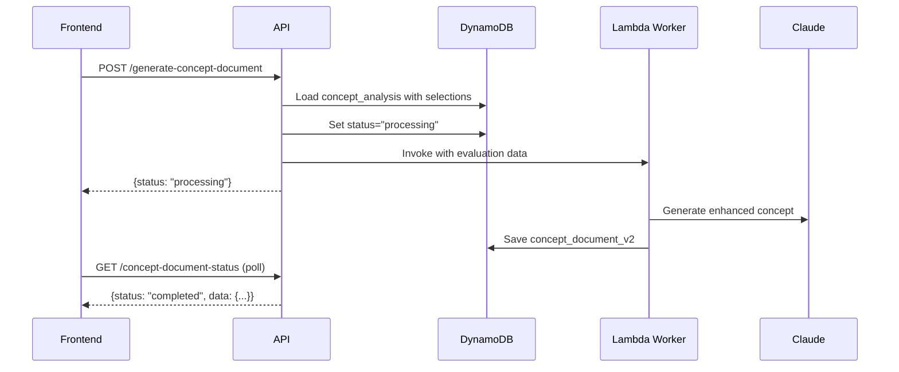

## Overview

Generates an enhanced concept document based on RFP analysis and user's concept evaluation. This endpoint takes the sections identified in concept analysis and creates a comprehensive, AI-enhanced version of the concept document.

<Warning>
  **Prerequisites**:
  - RFP analysis must be completed
  - Concept analysis must be completed
  - User must have selected/evaluated sections (via `/concept-evaluation` endpoint)
</Warning>

## Workflow Pattern

Follows the **asynchronous Lambda worker pattern**:

1. **Trigger**: POST to `/generate-concept-document` starts generation
2. **Validation**: Backend validates required data exists in DynamoDB
3. **Lambda Worker**: Invokes worker with `analysis_type: "concept_document"`
4. **Polling**: Poll GET `/concept-document-status` for completion
5. **Result**: Returns enhanced concept document in markdown format



## Request

<ParamField path="proposal_id" type="string" required>
  The proposal ID or code (format: `PROP-YYYYMMDD-XXXX`)
</ParamField>

<ParamField body="concept_evaluation" type="object" required>
  User's evaluation of concept analysis sections. This is typically populated by the frontend after the user reviews the concept analysis.
  
  <Expandable title="concept_evaluation structure">
    <ParamField body="concept_analysis" type="object" required>
      The concept analysis data with user selections. Each section in `sections_needing_elaboration` should have a `selected: true/false` field.
    </ParamField>
    
    <ParamField body="status" type="string" default="completed">
      Evaluation status
    </ParamField>
  </Expandable>
</ParamField>

<Note>
  **Important**: The backend uses the `concept_analysis` data stored in DynamoDB (which includes user selections from the `/concept-evaluation` endpoint), NOT the `concept_evaluation` parameter. The parameter acts as a trigger, but the source of truth is DynamoDB.
</Note>

## Response

<ResponseField name="status" type="string">
  - `processing`: Document generation started
</ResponseField>

<ResponseField name="message" type="string">
  Instruction to poll the status endpoint
</ResponseField>

## Example Request

```bash
curl -X POST "https://api.igad-innovation.org/api/proposals/PROP-20260304-A1B2/generate-concept-document" \
  -H "Authorization: Bearer YOUR_TOKEN" \
  -H "Content-Type: application/json" \
  -d '{
    "concept_evaluation": {
      "concept_analysis": {
        "sections_needing_elaboration": [
          {
            "title": "Technical Architecture",
            "selected": true
          }
        ]
      },
      "status": "completed"
    }
  }'
```

## Example Response

```json
{
  "status": "processing",
  "message": "Concept document generation started. Poll /concept-document-status for updates."
}
```

## User Selection Workflow

Before generating the concept document, users should review and select sections:

### Step 1: Update Concept Evaluation

```typescript
// Save user's section selections
const response = await fetch(
  `/api/proposals/${proposalId}/concept-evaluation`,
  {
    method: 'PUT',
    headers: {
      'Authorization': `Bearer ${token}`,
      'Content-Type': 'application/json'
    },
    body: JSON.stringify({
      selected_sections: [
        { title: 'Technical Architecture', selected: true },
        { title: 'Methodology', selected: true },
        { title: 'Risk Management', selected: false }
      ],
      user_comments: {
        'Technical Architecture': 'Please emphasize scalability'
      }
    })
  }
)
```

### Step 2: Generate Document

```typescript
// Trigger document generation
const response = await fetch(
  `/api/proposals/${proposalId}/generate-concept-document`,
  {
    method: 'POST',
    headers: {
      'Authorization': `Bearer ${token}`,
      'Content-Type': 'application/json'
    },
    body: JSON.stringify({
      concept_evaluation: { status: 'completed' }
    })
  }
)
```

### Step 3: Poll Status

```typescript
const pollStatus = async () => {
  const interval = setInterval(async () => {
    const response = await fetch(
      `/api/proposals/${proposalId}/concept-document-status`,
      { headers: { Authorization: `Bearer ${token}` } }
    )
    const data = await response.json()

    if (data.status === 'completed') {
      clearInterval(interval)
      displayConceptDocument(data.concept_document)
    }
  }, 3000)
}
```

## Lambda Worker Details

### Environment Variables

```python
worker_function = os.getenv("WORKER_FUNCTION_NAME")
```

### Lambda Invocation Payload

```python
payload = {
    "analysis_type": "concept_document",
    "proposal_id": proposal_code,  # PROP-YYYYMMDD-XXXX format
    "user_id": user_id,
    "concept_evaluation": final_concept_evaluation  # From DynamoDB with selections
}

lambda_client.invoke(
    FunctionName=worker_function,
    InvocationType="Event",  # Asynchronous
    Payload=json.dumps(payload)
)
```

### DynamoDB Updates

**Before invocation:**
```python
await db_client.update_item(
    pk=proposal["PK"],
    sk=proposal["SK"],
    update_expression="SET concept_document_status = :status, concept_document_started_at = :started",
    expression_attribute_values={
        ":status": "processing",
        ":started": datetime.utcnow().isoformat()
    }
)
```

**After completion (in worker):**
```python
db_client.update_item_sync(
    pk=pk,
    sk="METADATA",
    update_expression="SET concept_document_status = :status, concept_document_v2 = :doc, concept_document_completed_at = :completed",
    expression_attribute_values={
        ":status": "completed",
        ":doc": generated_document,
        ":completed": datetime.utcnow().isoformat()
    }
)
```

## Status Values

The `concept_document_status` field tracks generation progress:

| Status | Description |
|--------|-------------|
| `not_started` | No generation triggered |
| `processing` | Lambda worker is generating document |
| `completed` | Document generated successfully |
| `failed` | Generation encountered an error |

## Polling for Status

<Card title="GET /api/proposals/{proposal_id}/concept-document-status" icon="clock" href="#get-concept-document-status">
  Check concept document generation status
</Card>

## Error Handling

### Status Code 400 - Missing RFP Analysis

```json
{
  "detail": "RFP analysis not found. Complete Step 1 first."
}
```

### Status Code 400 - Missing Concept Analysis

```json
{
  "detail": "Concept analysis not found. Complete Step 1 first."
}
```

### Status Code 400 - Missing Proposal Code

```json
{
  "detail": "Proposal code not found"
}
```

### Status Code 404

```json
{
  "detail": "Proposal not found"
}
```

### Status Code 500

```json
{
  "detail": "Worker lambda invocation failed"
}
```

---

## GET Concept Document Status

<api method="GET" url="/api/proposals/{proposal_id}/concept-document-status" />

### Description

Poll this endpoint to check concept document generation status.

### Request

<ParamField path="proposal_id" type="string" required>
  The proposal ID or code
</ParamField>

### Response

<ResponseField name="status" type="string">
  Current status: `not_started`, `processing`, `completed`, or `failed`
</ResponseField>

<ResponseField name="started_at" type="string">
  ISO timestamp when generation started
</ResponseField>

<ResponseField name="completed_at" type="string">
  ISO timestamp when generation completed
</ResponseField>

<ResponseField name="concept_document" type="string">
  Generated concept document in markdown format (only when completed)
</ResponseField>

<ResponseField name="error" type="string">
  Error message (only when failed)
</ResponseField>

### Example Response (Completed)

```json
{
  "status": "completed",
  "started_at": "2026-03-04T10:40:00.000Z",
  "completed_at": "2026-03-04T10:42:15.000Z",
  "concept_document": "# Enhanced Concept Document\n\n## Executive Summary\n\nThis proposal aims to develop a comprehensive digital platform...\n\n## Technical Architecture\n\n### System Design\n\nThe platform will be built using a microservices architecture...\n\n### Scalability Considerations\n\nTo handle expected growth...\n\n## Methodology\n\n### Development Approach\n\nWe will employ Agile methodology with 2-week sprints..."
}
```

### Example Response (Processing)

```json
{
  "status": "processing",
  "started_at": "2026-03-04T10:40:00.000Z",
  "completed_at": null
}
```

### Example Response (Failed)

```json
{
  "status": "failed",
  "started_at": "2026-03-04T10:40:00.000Z",
  "error": "AI service temporarily unavailable"
}
```

## Document Format

The generated concept document is returned as markdown with:

- **Hierarchical structure**: Using `#`, `##`, `###` headers
- **Enhanced content**: AI-generated elaborations for selected sections
- **Formatted lists**: Bullet points and numbered lists where appropriate
- **Professional tone**: Suitable for submission to funding organizations

### Example Document Structure

```markdown
# Enhanced Concept Document

## Executive Summary
[AI-generated summary]

## Problem Statement
[Elaborated problem context]

## Proposed Solution

### Technical Architecture
[Detailed technical description]

### Implementation Methodology
[Step-by-step approach]

## Expected Outcomes
[Measurable deliverables]

## Budget Overview
[Cost breakdown]

## Timeline
[Project schedule]
```

## Next Steps

After the concept document is generated:

1. User reviews the enhanced document
2. User can download or export the document
3. Proceed to structure and workplan analysis (Step 3)

<Card title="POST /api/proposals/{proposal_id}/analyze-step-3" icon="sitemap" href="/api/proposals/analyze-step-3">
  Generate proposal structure and workplan
</Card>

## Best Practices

<Tip>
  **Optimize generation time**: Only select sections that truly need elaboration. Unselected sections will be excluded from AI processing, reducing generation time and cost.
</Tip>

<Check>
  **Save user selections first**: Always call PUT `/concept-evaluation` before generating the document to ensure user preferences are stored in DynamoDB.
</Check>

<Warning>
  **Don't retry immediately on failure**: If status returns `"failed"`, wait at least 30 seconds before retrying to avoid overwhelming the worker Lambda.
</Warning>
