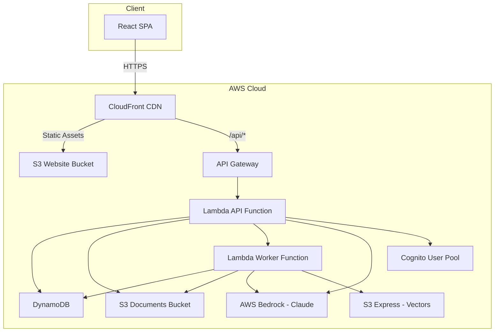

## Architecture Overview

Alliance IGAD Innovation Hub is built on a modern serverless architecture using AWS managed services. The platform combines React for the frontend, FastAPI for the backend API, AWS Lambda for compute, DynamoDB for data storage, and AWS Bedrock for AI capabilities.

<Note>
  The architecture is designed for:
  - **Scalability**: Serverless auto-scaling handles variable workloads
  - **Cost Efficiency**: Pay-per-use model with no idle infrastructure
  - **High Availability**: Multi-AZ deployment across AWS services
  - **Security**: AWS IAM, Cognito, and encryption at rest/in transit
</Note>

## High-Level Architecture



## Frontend Architecture

### Technology Stack

- **Framework**: React 18 with TypeScript
- **Build Tool**: Vite (fast HMR and optimized builds)
- **State Management**: 
  - React Query for server state (caching, polling, invalidation)
  - Zustand for client state (UI state, current step)
- **Styling**: Tailwind CSS with CSS Modules for complex components
- **Router**: React Router v6 with protected routes
- **Forms**: React Hook Form with validation

### Component Architecture

```
src/
├── pages/                     # Route-level components
│   ├── HomePage.tsx
│   ├── DashboardPage.tsx
│   └── NotFoundPage.tsx
├── shared/
│   ├── components/
│   │   ├── ui/               # Reusable UI components
│   │   │   ├── Button.tsx
│   │   │   ├── Card.tsx
│   │   │   ├── Modal.tsx
│   │   │   └── Toast.tsx
│   │   ├── Layout.tsx        # App shell
│   │   ├── Navigation.tsx    # Main navigation
│   │   └── ProtectedRoute.tsx # Auth guard
│   ├── hooks/
│   │   ├── useAuth.ts        # Authentication logic
│   │   ├── useToast.ts       # Toast notifications
│   │   └── usePolling.ts     # Polling for async operations
│   └── services/
│       ├── apiClient.ts      # Axios instance with interceptors
│       ├── authService.ts    # Auth API calls
│       └── tokenManager.ts   # JWT token handling
├── tools/
│   └── proposal-writer/      # Feature module
│       ├── components/       # Feature-specific UI
│       ├── pages/           # Step components
│       ├── hooks/           # useProposal, useProposalDraft
│       ├── services/        # proposalService API
│       └── types/           # TypeScript interfaces
└── App.tsx                   # Root component with routing
```

### Key Frontend Patterns

#### React Query for Server State

```typescript
import { useQuery, useMutation, useQueryClient } from '@tanstack/react-query'

// Fetch proposal with caching
const { data: proposal, isLoading, error } = useQuery({
  queryKey: ['proposal', proposalId],
  queryFn: () => proposalService.getProposal(proposalId),
  staleTime: 5 * 60 * 1000, // 5 minutes
  enabled: !!proposalId
})

// Mutation with optimistic updates
const queryClient = useQueryClient()
const updateMutation = useMutation({
  mutationFn: proposalService.updateProposal,
  onSuccess: () => {
    queryClient.invalidateQueries({ queryKey: ['proposal', proposalId] })
  }
})
```

#### Polling for Async Operations

```typescript
// Poll analysis status every 3 seconds
const { data: status } = useQuery({
  queryKey: ['analysis-status', proposalId],
  queryFn: () => proposalService.getAnalysisStatus(proposalId),
  refetchInterval: (data) => {
    // Stop polling when complete or failed
    if (data?.status === 'completed' || data?.status === 'failed') {
      return false
    }
    return 3000 // Poll every 3 seconds
  },
  enabled: isAnalyzing
})
```

### Build & Deployment

```bash
# Development
npm run dev              # Vite dev server on port 3000

# Production build
npm run build            # Output to dist/
vite build               # Optimized bundle with code splitting

# Deploy to S3 + CloudFront
aws s3 sync dist/ s3://igad-website-bucket/ --delete
aws cloudfront create-invalidation --distribution-id E1234567890 --paths "/*"
```

**Build Output:**
- Minified JS bundles with tree-shaking
- Code-split by route for faster initial load
- CSS extracted and minified
- Assets fingerprinted for long-term caching

## Backend Architecture

### Technology Stack

- **Framework**: FastAPI (Python 3.11)
- **Runtime**: AWS Lambda with Mangum adapter
- **API Gateway**: REST API with CORS configured
- **Authentication**: AWS Cognito User Pools
- **Async Processing**: Lambda invocation for long-running tasks

### Project Structure

```
backend/
├── app/
│   ├── main.py                      # FastAPI app entry point
│   ├── database/
│   │   └── client.py                # DynamoDB client wrapper
│   ├── middleware/
│   │   ├── auth_middleware.py       # JWT verification
│   │   ├── error_middleware.py      # Global error handling
│   │   └── security_middleware.py   # CORS, headers
│   ├── shared/
│   │   ├── ai/
│   │   │   ├── bedrock_service.py   # Claude API wrapper
│   │   │   └── knowledge_base_service.py
│   │   ├── documents/
│   │   │   └── routes.py            # Document upload/download
│   │   ├── health/
│   │   │   └── routes.py            # Health check endpoint
│   │   └── vectors/
│   │       ├── routes.py            # Vector operations
│   │       └── service.py           # S3 Express vector service
│   └── tools/
│       ├── auth/
│       │   ├── routes.py            # /api/auth endpoints
│       │   └── service.py
│       ├── admin/
│       │   ├── prompts_manager/     # AI prompt CRUD
│       │   └── settings/            # System settings
│       └── proposal_writer/
│           ├── routes.py            # /api/proposals endpoints
│           ├── rfp_analysis/
│           │   ├── service.py       # RFP analysis logic
│           │   └── config.py        # AI settings
│           ├── concept_document_generation/
│           │   ├── service.py
│           │   └── config.py
│           ├── existing_work_analysis/
│           ├── reference_proposals_analysis/
│           ├── structure_workplan/
│           ├── proposal_template_generation/
│           └── workflow/
│               └── worker.py        # Lambda worker handler
├── requirements.txt
└── bootstrap                        # Lambda entry point
```

### FastAPI Application

**app/main.py:**

```python
from fastapi import FastAPI
from fastapi.middleware.cors import CORSMiddleware
from mangum import Mangum

# Initialize FastAPI
app = FastAPI(
    title="IGAD Innovation Hub API",
    version="1.0.0",
    docs_url="/docs" if ENVIRONMENT != "production" else None
)

# CORS configuration
allowed_origins = [
    "https://test-igad-hub.alliance.cgiar.org",
    "https://igad-innovation-hub.com"
]

app.add_middleware(
    CORSMiddleware,
    allow_origins=allowed_origins,
    allow_credentials=True,
    allow_methods=["GET", "POST", "PUT", "DELETE", "OPTIONS"],
    allow_headers=["Content-Type", "Authorization"],
    max_age=3600
)

# Include routers
app.include_router(auth_routes.router)
app.include_router(proposal_writer_routes.router)
app.include_router(documents_routes.router)
app.include_router(health_routes.router)

# Lambda handler
handler = Mangum(app)
```

### Authentication Flow

```python
from fastapi import Depends, HTTPException
from fastapi.security import HTTPBearer, HTTPAuthorizationCredentials
import boto3
import jwt

security = HTTPBearer()

class AuthMiddleware:
    def __init__(self):
        self.cognito = boto3.client('cognito-idp')
        self.user_pool_id = os.getenv('COGNITO_USER_POOL_ID')
    
    def verify_token(self, credentials: HTTPAuthorizationCredentials):
        """Verify JWT token from Cognito."""
        token = credentials.credentials
        
        try:
            # Decode and verify JWT
            decoded = jwt.decode(
                token,
                options={"verify_signature": False}  # Cognito pre-verifies
            )
            
            return {
                "user_id": decoded["sub"],
                "email": decoded["email"],
                "groups": decoded.get("cognito:groups", [])
            }
        except jwt.ExpiredSignatureError:
            raise HTTPException(status_code=401, detail="Token expired")
        except Exception:
            raise HTTPException(status_code=401, detail="Invalid token")

def get_current_user(credentials: HTTPAuthorizationCredentials = Depends(security)):
    """Dependency for protected endpoints."""
    return auth_middleware.verify_token(credentials)
```

### Async Worker Pattern

For long-running AI operations (3-5 minutes), the API triggers a Lambda worker asynchronously:

**Trigger (API Function):**

```python
@router.post("/proposals/{proposal_id}/analyze-rfp")
async def analyze_rfp(proposal_id: str, user=Depends(get_current_user)):
    # Set status to processing
    await db_client.update_item(
        pk=f"PROPOSAL#{proposal_id}",
        sk="METADATA",
        update_expression="SET analysis_status_rfp = :s",
        expression_attribute_values={":s": "processing"}
    )
    
    # Invoke worker Lambda asynchronously
    lambda_client.invoke(
        FunctionName=os.getenv("WORKER_FUNCTION_NAME"),
        InvocationType="Event",  # Async invocation
        Payload=json.dumps({
            "task": "analyze_rfp",
            "proposal_id": proposal_id
        })
    )
    
    return {"status": "processing", "message": "Analysis started"}
```

**Worker (Separate Lambda Function):**

```python
# app/tools/proposal_writer/workflow/worker.py

def handler(event, context):
    """Lambda worker for async tasks."""
    task = event.get("task")
    proposal_id = event.get("proposal_id")
    
    if task == "analyze_rfp":
        try:
            analyzer = RFPAnalyzer()
            result = analyzer.analyze_rfp(proposal_id)
            
            # Save result
            db_client.update_item_sync(
                pk=f"PROPOSAL#{proposal_id}",
                sk="METADATA",
                update_expression="SET analysis_status_rfp = :s, rfp_analysis = :r",
                expression_attribute_values={
                    ":s": "completed",
                    ":r": result
                }
            )
        except Exception as e:
            # Save error
            db_client.update_item_sync(
                pk=f"PROPOSAL#{proposal_id}",
                sk="METADATA",
                update_expression="SET analysis_status_rfp = :s, error = :e",
                expression_attribute_values={
                    ":s": "failed",
                    ":e": str(e)
                }
            )
```

## Data Architecture

### DynamoDB Single-Table Design

The platform uses a single DynamoDB table with composite keys for efficient queries.

**Table: `igad-testing-main-table`**

| Partition Key (PK) | Sort Key (SK) | GSI1PK | GSI1SK | Description |
|-------------------|---------------|--------|--------|-------------|
| `PROPOSAL#{code}` | `METADATA` | `USER#{userId}` | `PROPOSAL#{timestamp}` | Proposal metadata |
| `PROPOSAL#{code}` | `RFP_ANALYSIS` | - | - | RFP analysis result |
| `PROPOSAL#{code}` | `CONCEPT_ANALYSIS` | - | - | Concept evaluation |
| `PROPOSAL#{code}` | `CONCEPT_DOCUMENT_V2` | - | - | Generated concept doc |
| `PROPOSAL#{code}` | `OUTLINE` | - | - | Proposal outline |
| `PROPOSAL#{code}` | `TEMPLATE` | - | - | Proposal template |
| `prompt#{id}` | `version#{v}` | - | - | AI prompt templates |
| `USER#{userId}` | `PROFILE` | - | - | User profile |

**Access Patterns:**

```python
# Get proposal by ID
proposal = table.get_item(
    Key={
        "PK": f"PROPOSAL#{proposal_code}",
        "SK": "METADATA"
    }
)

# Query all proposals for a user (using GSI)
proposals = table.query(
    IndexName="GSI1",
    KeyConditionExpression="GSI1PK = :pk",
    ExpressionAttributeValues={
        ":pk": f"USER#{user_id}"
    }
)

# Get all data for a proposal
items = table.query(
    KeyConditionExpression="PK = :pk",
    ExpressionAttributeValues={
        ":pk": f"PROPOSAL#{proposal_code}"
    }
)
```

<Warning>
  **Pagination Required**: DynamoDB returns a maximum of 1MB per query. Always handle pagination using `LastEvaluatedKey` and `ExclusiveStartKey` when querying large datasets.
</Warning>

### S3 Document Storage

**Bucket: `igad-proposal-documents-{account_id}`**

Document organization:

```
{proposal_code}/
├── documents/
│   ├── rfp-document/
│   │   └── rfp.pdf
│   ├── initial_concept/
│   │   ├── concept_text.txt
│   │   └── concept.docx
│   ├── reference-proposals/
│   │   ├── reference-1.pdf
│   │   ├── reference-2.pdf
│   │   └── reference-3.pdf
│   └── existing-work/
│       ├── project-report.pdf
│       └── technical-paper.pdf
└── exports/
    └── proposal-final.docx
```

**S3 Configuration:**
- **Versioning**: Enabled for document history
- **Lifecycle**: Delete old versions after 30 days
- **Encryption**: AES-256 at rest
- **Access**: Private with IAM-based access only

### S3 Express One Zone - Vector Storage

**Bucket: `igad-proposals-vectors-testing--use1-az4--x-s3`**

Used for semantic search over reference documents:

```python
import boto3

s3_client = boto3.client('s3vectors')

# Add document vectors
s3_client.put_vectors(
    Bucket='igad-proposals-vectors-testing',
    Key=f'{proposal_code}/reference-1.pdf',
    Vectors=embeddings,  # 1536-dimensional embeddings from Bedrock
    VectorIndexName='default'
)

# Query similar content
response = s3_client.query_vectors(
    Bucket='igad-proposals-vectors-testing',
    VectorIndexName='default',
    QueryVector=query_embedding,
    MaxResults=10
)
```

## AI/ML Architecture

### AWS Bedrock Integration

**Service: `BedrockService`** (`app/shared/ai/bedrock_service.py`)

```python
import boto3
import json

class BedrockService:
    def __init__(self):
        self.client = boto3.client('bedrock-runtime', region_name='us-east-1')
        self.model_id = 'us.anthropic.claude-sonnet-4-20250514-v1:0'
    
    def invoke_claude(
        self,
        system_prompt: str,
        user_prompt: str,
        max_tokens: int = 12000,
        temperature: float = 0.2
    ) -> str:
        """Invoke Claude via Bedrock."""
        
        request_body = {
            "anthropic_version": "bedrock-2023-05-31",
            "max_tokens": max_tokens,
            "temperature": temperature,
            "system": system_prompt,
            "messages": [
                {
                    "role": "user",
                    "content": user_prompt
                }
            ]
        }
        
        response = self.client.invoke_model(
            modelId=self.model_id,
            body=json.dumps(request_body)
        )
        
        result = json.loads(response['body'].read())
        return result['content'][0]['text']
```

### AI Prompt Management

Prompts are stored in DynamoDB and versioned:

```python
{
    "PK": "prompt#rfp-analysis-v2",
    "SK": "version#1",
    "name": "RFP Analysis - Comprehensive",
    "section": "proposal_writer",
    "sub_section": "step-1",
    "categories": ["RFP Analysis"],
    "is_active": True,
    "system_prompt": "You are an expert grant proposal analyst...",
    "user_prompt_template": "Analyze this RFP: {{rfp_content}}",
    "output_format": "Return JSON with: executive_summary, eligibility_criteria...",
    "model": "us.anthropic.claude-sonnet-4-20250514-v1:0",
    "max_tokens": 12000,
    "temperature": 0.2
}
```

### Prompt Placeholder Replacement

```python
def replace_placeholders(template: str, context: dict) -> str:
    """Replace {{key}} and {[KEY]} placeholders."""
    prompt = template
    
    for key, value in context.items():
        # Format 1: {{key}}
        prompt = prompt.replace(f"{{{{{key}}}}}", str(value))
        
        # Format 2: {[KEY]} (uppercase with spaces)
        key_upper = key.upper().replace("_", " ")
        prompt = prompt.replace(f"{{[{key_upper}]}}", str(value))
    
    return prompt
```

## Deployment Architecture

### AWS SAM Template

**template.yaml:**

```yaml
AWSTemplateFormatVersion: '2010-09-09'
Transform: AWS::Serverless-2016-10-31
Description: IGAD Innovation Hub - Fullstack Deployment

Resources:
  # API Gateway
  ApiGateway:
    Type: AWS::Serverless::Api
    Properties:
      StageName: prod
      BinaryMediaTypes:
        - 'multipart/form-data'
        - 'application/pdf'
  
  # Main API Lambda
  ApiFunction:
    Type: AWS::Serverless::Function
    Properties:
      CodeUri: backend/dist
      Handler: bootstrap
      Runtime: python3.11
      MemorySize: 512
      Timeout: 300  # 5 minutes
      Architectures:
        - arm64
      Environment:
        Variables:
          COGNITO_USER_POOL_ID: us-east-1_IMi3kSuB8
          COGNITO_CLIENT_ID: 7p11hp6gcklhctcr9qffne71vl
          TABLE_NAME: igad-testing-main-table
          PROPOSALS_BUCKET: !Ref ProposalDocumentsBucket
          WORKER_FUNCTION_NAME: !Ref AnalysisWorkerFunction
          ENVIRONMENT: testing
      Policies:
        - AWSLambdaBasicExecutionRole
        - DynamoDBCrudPolicy:
            TableName: igad-testing-main-table
        - S3CrudPolicy:
            BucketName: !Ref ProposalDocumentsBucket
        - Statement:
          - Effect: Allow
            Action:
              - bedrock:InvokeModel
              - bedrock:InvokeModelWithResponseStream
            Resource: '*'
      Layers:
        - !Sub "arn:aws:lambda:${AWS::Region}:753240598075:layer:LambdaAdapterLayerArm64:25"
      Events:
        ApiEvent:
          Type: Api
          Properties:
            RestApiId: !Ref ApiGateway
            Path: /api/{proxy+}
            Method: ANY
  
  # Worker Lambda for async tasks
  AnalysisWorkerFunction:
    Type: AWS::Serverless::Function
    Properties:
      CodeUri: backend/dist
      Handler: app.tools.proposal_writer.workflow.worker.handler
      Runtime: python3.11
      MemorySize: 1024
      Timeout: 900  # 15 minutes
      Architectures:
        - arm64
      Environment:
        Variables:
          TABLE_NAME: igad-testing-main-table
          PROPOSALS_BUCKET: !Ref ProposalDocumentsBucket
      Policies:
        - AWSLambdaBasicExecutionRole
        - DynamoDBCrudPolicy:
            TableName: igad-testing-main-table
        - S3CrudPolicy:
            BucketName: !Ref ProposalDocumentsBucket
        - Statement:
          - Effect: Allow
            Action:
              - bedrock:InvokeModel
            Resource: '*'
  
  # S3 Bucket for documents
  ProposalDocumentsBucket:
    Type: AWS::S3::Bucket
    Properties:
      BucketName: !Sub 'igad-proposal-documents-${AWS::AccountId}'
      VersioningConfiguration:
        Status: Enabled
      LifecycleConfiguration:
        Rules:
          - Id: DeleteOldVersions
            Status: Enabled
            NoncurrentVersionExpirationInDays: 30
      PublicAccessBlockConfiguration:
        BlockPublicAcls: true
        BlockPublicPolicy: true
        IgnorePublicAcls: true
        RestrictPublicBuckets: true
  
  # CloudFront for frontend
  WebsiteDistribution:
    Type: AWS::CloudFront::Distribution
    Properties:
      DistributionConfig:
        Enabled: true
        DefaultRootObject: index.html
        Origins:
          - DomainName: !GetAtt WebsiteBucket.RegionalDomainName
            Id: S3Origin
            OriginAccessControlId: !GetAtt CloudFrontOriginAccessControl.Id
            S3OriginConfig:
              OriginAccessIdentity: ""
          - DomainName: !Sub "${ApiGateway}.execute-api.${AWS::Region}.amazonaws.com"
            Id: ApiOrigin
            OriginPath: "/prod"
            CustomOriginConfig:
              OriginProtocolPolicy: https-only
        DefaultCacheBehavior:
          TargetOriginId: S3Origin
          ViewerProtocolPolicy: redirect-to-https
          ForwardedValues:
            QueryString: false
        CacheBehaviors:
          - PathPattern: "/api/*"
            TargetOriginId: ApiOrigin
            ViewerProtocolPolicy: https-only
            AllowedMethods: [GET, HEAD, OPTIONS, PUT, POST, PATCH, DELETE]
            DefaultTTL: 0
            MinTTL: 0
            MaxTTL: 0
            ForwardedValues:
              QueryString: true
              Headers: ["Authorization"]

Outputs:
  ApiEndpoint:
    Value: !Sub "https://${ApiGateway}.execute-api.${AWS::Region}.amazonaws.com/prod/"
  CloudFrontURL:
    Value: !Sub "https://${WebsiteDistribution.DomainName}"
```

### Deployment Process

```bash
#!/bin/bash
# scripts/deploy-fullstack-testing.sh

set -e

echo "Deploying to Testing Environment..."

# 1. Build frontend
cd frontend
npm run build
cd ..

# 2. Package backend
cd backend
pip install -r requirements.txt -t dist/
cp -r app dist/
cp bootstrap dist/
cd ..

# 3. Deploy SAM stack
sam build
sam deploy \
  --config-file samconfig.toml \
  --config-env testing \
  --no-confirm-changeset

# 4. Upload frontend to S3
aws s3 sync frontend/dist/ s3://igad-testing-website-bucket/ --delete

# 5. Invalidate CloudFront cache
DISTRIBUTION_ID=$(aws cloudformation describe-stacks \
  --stack-name igad-testing-stack \
  --query "Stacks[0].Outputs[?OutputKey=='CloudFrontDistributionId'].OutputValue" \
  --output text)

aws cloudfront create-invalidation \
  --distribution-id $DISTRIBUTION_ID \
  --paths "/*"

echo "Deployment complete!"
```

## Security Architecture

### Authentication & Authorization

- **AWS Cognito User Pools**: User authentication with JWT tokens
- **Token Expiration**: Access tokens expire after 1 hour
- **Refresh Tokens**: Valid for 30 days
- **Role-Based Access Control**:
  - `user` group: Standard proposal creation
  - `admin` group: User management, prompt configuration

### Network Security

- **CloudFront**: HTTPS only, custom error pages
- **API Gateway**: Throttling (10,000 requests/sec)
- **Lambda**: VPC deployment (optional for database access)
- **S3**: Private buckets, signed URLs for downloads

### Data Encryption

- **At Rest**: 
  - S3: AES-256 encryption
  - DynamoDB: AWS KMS encryption
- **In Transit**: TLS 1.2+ for all connections

## Monitoring & Observability

### CloudWatch Metrics

```python
import boto3

cloudwatch = boto3.client('cloudwatch')

# Custom metric for AI operations
cloudwatch.put_metric_data(
    Namespace='IGADInnovationHub',
    MetricData=[
        {
            'MetricName': 'RFPAnalysisLatency',
            'Value': elapsed_seconds,
            'Unit': 'Seconds',
            'Dimensions': [
                {'Name': 'Environment', 'Value': 'testing'}
            ]
        }
    ]
)
```

### CloudWatch Logs

- **API Function**: `/aws/lambda/igad-testing-ApiFunction`
- **Worker Function**: `/aws/lambda/igad-testing-AnalysisWorkerFunction`
- **Retention**: 7 days (testing), 30 days (production)

### X-Ray Tracing

Enabled on Lambda functions for distributed tracing:

```python
from aws_xray_sdk.core import xray_recorder
from aws_xray_sdk.ext.flask.middleware import XRayMiddleware

# Trace Bedrock calls
with xray_recorder.capture('bedrock_invocation'):
    response = bedrock.invoke_model(...)
```

## Performance Optimization

### Frontend Optimizations

- **Code Splitting**: Route-based chunks
- **Lazy Loading**: Components loaded on demand
- **React Query Caching**: 5-minute stale time for proposal data
- **Debounced Inputs**: 300ms debounce on search/filter

### Backend Optimizations

- **Lambda Provisioned Concurrency**: 2 instances warm (production)
- **DynamoDB On-Demand**: Auto-scaling for variable workloads
- **S3 Transfer Acceleration**: Enabled for large file uploads
- **Bedrock Batch Processing**: Queue multiple sections for generation

### Cost Optimization

| Service | Pricing Model | Estimated Monthly Cost (100 proposals) |
|---------|---------------|---------------------------------------|
| Lambda API | Per request + duration | $20-50 |
| Lambda Worker | Per execution | $50-100 |
| Bedrock (Claude) | Per token | $200-400 |
| DynamoDB | On-demand | $10-20 |
| S3 | Storage + requests | $5-15 |
| CloudFront | Data transfer | $10-30 |
| **Total** | | **$295-615/month** |

<Note>
  Costs scale primarily with Bedrock usage. Optimize by caching AI responses and using shorter prompts where appropriate.
</Note>

## Disaster Recovery

### Backup Strategy

- **DynamoDB**: Point-in-time recovery enabled (35 days)
- **S3**: Versioning enabled, cross-region replication (optional)
- **Code**: GitHub repository with protected main branch

### Recovery Procedures

```bash
# Restore DynamoDB table to point in time
aws dynamodb restore-table-to-point-in-time \
  --source-table-name igad-testing-main-table \
  --target-table-name igad-testing-main-table-restored \
  --restore-date-time "2026-03-04T10:00:00Z"

# Restore S3 bucket from version
aws s3api get-object \
  --bucket igad-proposal-documents \
  --key PROP-123/documents/rfp.pdf \
  --version-id abc123
```

## Scaling Considerations

### Current Limits

- **Lambda Concurrent Executions**: 1,000 (regional quota)
- **DynamoDB**: 40,000 read/write capacity units on-demand
- **Bedrock**: 10,000 tokens/minute (can be increased)
- **S3**: Unlimited requests

### Scaling Strategy

1. **Horizontal Scaling**: Lambda auto-scales based on request volume
2. **Bedrock Throttling**: Implement queue for AI requests during peak load
3. **DynamoDB Burst Capacity**: Handles short spikes automatically
4. **CloudFront Caching**: Reduces origin load

## Next Steps

<CardGroup cols={2}>
  <Card title="API Reference" icon="code" href="/api-reference">
    Detailed API endpoint documentation with request/response examples
  </Card>
  
  <Card title="Admin Guide" icon="users-gear" href="/admin">
    Learn how to manage users, configure AI prompts, and customize settings
  </Card>
  
  <Card title="Developer Guide" icon="terminal" href="/developer">
    Set up local development environment and contribute to the platform
  </Card>
  
  <Card title="Troubleshooting" icon="wrench" href="/troubleshooting">
    Common issues and solutions for deployment and runtime errors
  </Card>
</CardGroup>